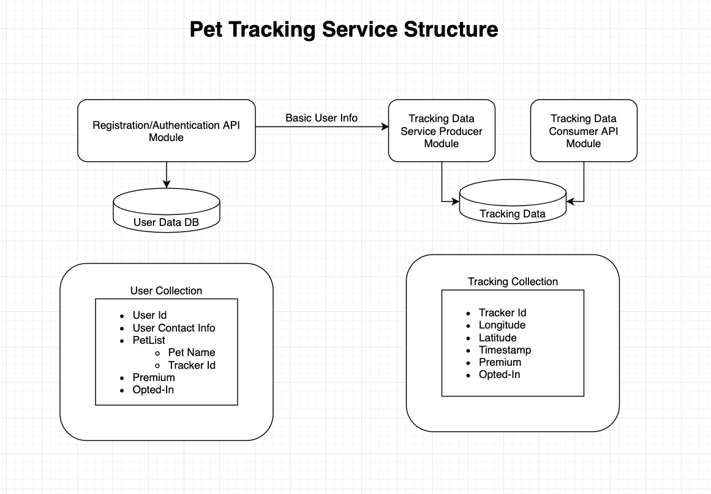

# Pet-Tracker-Services

# Assumptions

We are using a very high and scalable database to store this information, the data will be created, stored and available at any time. 
We are assuming that they asked us to deploy this application in kubernetes for now.

For development purposes we will be using docker-compose.

# Structure Graph

The structure will be set on 3 modules:

* Registration/Authentication module (This could be separated as needed based on requirements)
* Tracking Data Producer: This module will collect tracking information data from trackers
* Tracking Data Consumer: This will be used to query data to clients.

# Service

## Registration/Authentication API

The Registartion API is in charge of registering a user to the system

The Authentication API autheticates users into the system it also validates token id for communication between modules

## Tracking Data Producer API

We are assuming this service is being done by a third party and that we are just receiving data and saving it to database  

## Tracking Data Consumer API

This module is use for querying data by the client. 
We can also use the module to create direct connection and send data as is being received directly to the client through stream service, sockets, etc.

# Work Plan

We are assuming that all technical requirements have already been gathered and established.

We will build the modules in the following order:

* Registration/Authentication Module (This could be separate modules one for registration and second one for authentication to be reuse with other modules)
* Tracking Data Consumer Module
* Create canned data into the database to be used for testing.
* Tracking Data Producer Module

Every module will contain a suite of automated unit test.

CI/CD pipeline will need to be created for automation, testing and deployment of code into development server and production.

# Environments

## Development Server

Server to be used for testing while front-end client will in development phase.
All tracking data available at this stage will be canned data previously collected.

## Production Server

Production ready server that has the Tracking Data Producer Module working full time.
All other module working and deployed to this environment.

## HOW TO RUN

To use this project you will need nodejs and `npm` install on the computer as well as docker

To start project:

* Go to root project directory and run `docker-compose up --build`
